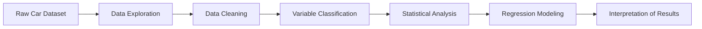

# The Effect of Quantitative and Qualitative Variables on Car Prices

---

## 1. Project Overview

This project analyzes the relationship between car prices and a set of quantitative and qualitative variables. The goal is to understand how different features of a car influence its final market price using statistical analysis and regression techniques.

The study focuses on identifying patterns between car attributes and price variations without assuming complex machine learning pipelines, but rather relying on structured statistical interpretation.

---

## 2. Project Objective

The main objective of this project is to:

* Investigate the relationship between car price and different explanatory variables
* Analyze both numerical (quantitative) and categorical (qualitative) factors
* Identify which variables have the strongest influence on price
* Build a statistical model to describe price behavior
* Interpret results in a meaningful way for decision-making

---

## 3. Key Stakeholders

This analysis can be useful for:

* Automotive analysts
* Car dealerships
* Market researchers
* Data analysis learners
* Business decision makers in automotive pricing

---

## 4. Key Variables

The dataset includes:

### Quantitative Variables:

* Mileage
* Engine size
* Horsepower
* Number of cylinders (if numerical in dataset)

### Qualitative Variables:

* Fuel type
* Car brand / model
* Body type
* Transmission type (if included)

---

## 5. System Workflow



---

## 6. System Analysis

### 6.1 Input Data

The dataset consists of car-related attributes including both numerical and categorical variables along with the target variable (price).

---

### 6.2 Data Processing Steps

The analysis includes:

* Understanding variable types (quantitative vs qualitative)
* Handling missing or inconsistent data
* Exploring relationships between variables
* Converting categorical variables for analysis when needed
* Performing regression analysis

---

### 6.3 Output Results

The project produces:

* Statistical summaries of variables
* Relationship analysis between features and price
* Regression model interpretation
* Insights about which variables influence price most

---

## 7. Statistical Analysis

### 7.1 Correlation and Relationship Analysis

The project examines how strongly each quantitative variable is related to price, and how categorical variables affect price differences between groups.

---

### 7.2 Regression Analysis Concept

A multiple regression approach is used conceptually to estimate car price as a function of multiple variables:

* Quantitative variables are included directly
* Qualitative variables are converted into indicator (dummy) variables

The model helps estimate how each feature contributes to price changes.

---

## 8. Key Insights

The analysis helps answer:

* Which car features increase price
* How mileage affects resale value
* Whether brand or fuel type significantly impacts pricing
* How engine specifications influence market value

---

## 9. Repository Structure

```
The-effect-of-quantitative-and-qualitative-variables-on-the-price-of-the-car

data/
   dataset file(s)

notebooks/
   analysis notebook (if applicable)

reports/
   project report or documentation

README.md
```

---

## 10. Conclusion

This project provides a clear statistical understanding of how car characteristics affect pricing. It highlights the importance of both numerical and categorical variables in determining car value and demonstrates how regression analysis can be used to interpret real-world datasets.

---
